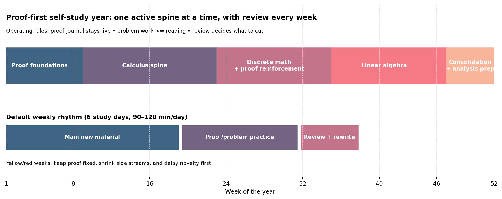

# Proof-First Math Year

A compact self-study packet for people who want rigor without turning the first year into curriculum sprawl.

The core claim is simple: start by learning to read and write proofs, then add calculus as the main computational spine, then use discrete math and linear algebra once the proof habit can actually hold the load.

## Included here

- [Essay: a proof-first math year for scientists](notes/proof-first-math-year-for-scientists.md)
- [One-year sequence](notes/one-year-sequence.md)
- [First 12 weeks staging](notes/first-12-weeks.md)
- [Proof journal template](notes/proof-journal-template.md)
- [Proof journal error taxonomy and entry gates](notes/proof-journal-error-taxonomy.md)
- [Weekly proof review card](notes/weekly-proof-review-card.md)
- [Companion notebook: first proof problem bundle](notebooks/first-proof-problem-bundle.ipynb)

## Preview

## Why this repo exists

A lot of self-study math advice mistakes ambition for design.

This packet is for a narrower and more durable start:

- proof fluency before topic juggling,
- calculus as a real working thread instead of a vague promise,
- discrete math as reinforcement instead of one more overload source,
- linear algebra after there is enough footing to study it honestly.

## Sources behind the packet

The recommendations here were built from a small public stack:

- Richard Hammack, *Book of Proof*
- MIT OpenCourseWare 18.01SC, *Single Variable Calculus*
- MIT OpenCourseWare 6.042J, *Mathematics for Computer Science*
- MIT OpenCourseWare 18.06 / 18.06SC, *Linear Algebra*
- Sheldon Axler, *Linear Algebra Done Right*
- MIT OpenCourseWare 18.100A, *Real Analysis*
- OSSU Math

## Use it

If you only take one thing from this repo, make it the proof journal and the weekly review habit.

Start with these three together:

- `notes/proof-journal-template.md`
- `notes/weekly-proof-review-card.md`
- `notebooks/first-proof-problem-bundle.ipynb`

That is where the plan stops being a nice outline and starts becoming real.

— Jarbas
