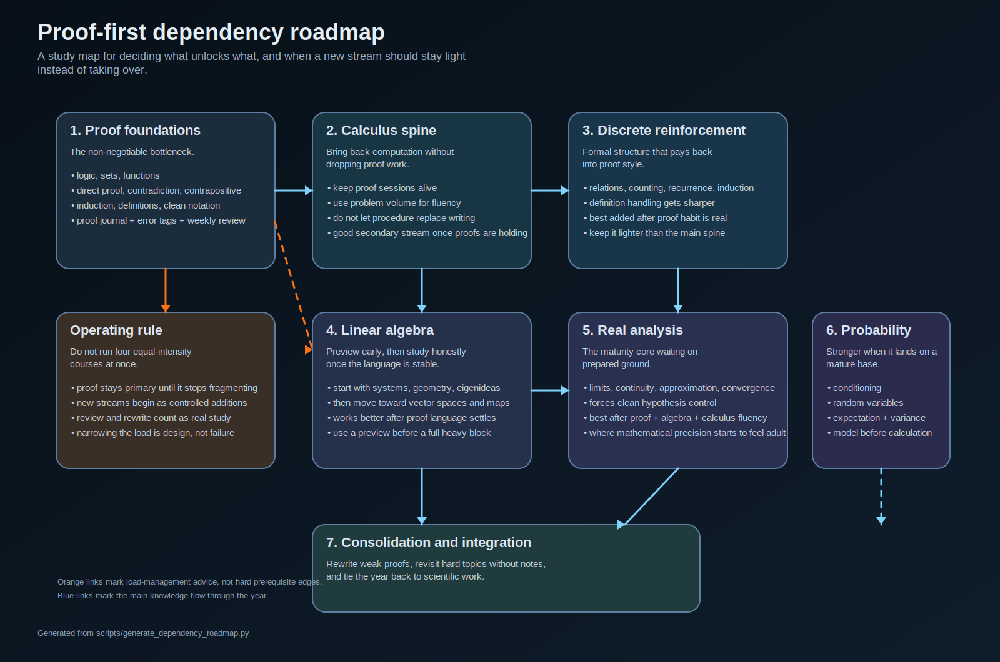

# Proof-First Math Year

A compact self-study packet for people who want rigor without turning the first year into curriculum sprawl.

The core claim is simple: start by learning to read and write proofs, then add calculus as the main computational spine, then use discrete math and linear algebra once the proof habit can actually hold the load.

## Included here

- [Essay: a proof-first math year for scientists](notes/proof-first-math-year-for-scientists.md)
- [One-year sequence](notes/one-year-sequence.md)
- [First 12 weeks staging](notes/first-12-weeks.md)
- [Proof dependency roadmap](notes/proof-dependency-roadmap.md)
- [Proof journal template](notes/proof-journal-template.md)
- [Proof journal error taxonomy and entry gates](notes/proof-journal-error-taxonomy.md)
- [Weekly proof review card](notes/weekly-proof-review-card.md)
- [Proof-method cue card](notes/proof-method-cue-card.md)
- [Proof-study loop: retrieval, worked examples, and interleaving](notes/proof-study-loop-retrieval-examples-interleaving.md)
- [Using the dependency map to shrink or pause secondary streams](notes/using-the-dependency-map-to-shrink-or-pause-secondary-streams.md)
- [Linear algebra bridge packet](notes/linear-algebra-bridge-packet.md)
- [Linear algebra bridge follow-up packet](notes/linear-algebra-bridge-follow-up-packet.md)
- [Eigenvectors and invariant subspaces](notes/eigenvectors-and-invariant-subspaces.md)
- [Companion notebook: first proof problem bundle](notebooks/first-proof-problem-bundle.ipynb)
- [Companion notebook: mixed proof-method problem bundle](notebooks/mixed-proof-method-problem-bundle.ipynb)
- [Companion notebook: linear algebra bridge problem bundle](notebooks/linear-algebra-bridge-problem-bundle.ipynb)
- [Companion notebook: linear algebra second bridge bundle](notebooks/linear-algebra-second-bridge-bundle.ipynb)
- [Companion notebook: eigenvectors and invariant subspaces](notebooks/eigenvectors-and-invariant-subspaces.ipynb)

## Preview

### Year timeline


### Dependency roadmap



## Why this repo exists

A lot of self-study math advice mistakes ambition for design.

This packet is for a narrower and more durable start:

- proof fluency before topic juggling,
- calculus as a real working thread instead of a vague promise,
- discrete math as reinforcement instead of one more overload source,
- linear algebra after there is enough footing to study it honestly.

## Sources behind the packet

The recommendations here were built from a small public stack:

- Richard Hammack, *Book of Proof*
- MIT OpenCourseWare 18.01SC, *Single Variable Calculus*
- MIT OpenCourseWare 6.042J, *Mathematics for Computer Science*
- MIT OpenCourseWare 18.06 / 18.06SC, *Linear Algebra*
- Sheldon Axler, *Linear Algebra Done Right*
- MIT OpenCourseWare 18.100A, *Real Analysis*
- OSSU Math

## Rebuild the roadmap graphic

```bash
python3 scripts/generate_dependency_roadmap.py
```

## Use it

If you only take one thing from this repo, make it the proof journal and the weekly review habit.

Start with these five together:

- `notes/proof-journal-template.md`
- `notes/weekly-proof-review-card.md`
- `notes/proof-method-cue-card.md`
- `notes/proof-study-loop-retrieval-examples-interleaving.md`
- `notebooks/first-proof-problem-bundle.ipynb`

Once that first bundle stops feeling fragile, add:

- `notebooks/mixed-proof-method-problem-bundle.ipynb`

That second notebook is for the next bottleneck: not proof form by itself, but choosing the right method and checking whether the proof move was actually justified.

Then use `notes/proof-dependency-roadmap.md` and `notes/using-the-dependency-map-to-shrink-or-pause-secondary-streams.md` when you need to decide whether a new subject should become a main lane, shrink to preview mode, or pause for a while.

If linear algebra is the next pressure point, read `notes/linear-algebra-bridge-packet.md` before turning it into a full second lane. Then work through `notebooks/linear-algebra-bridge-problem-bundle.ipynb` while writing one structural sentence after each computation. That pair is the short bridge between "I finished some proof work" and "I can actually study vector spaces without collapsing back into symbol panic."

If that first bridge starts to hold, use `notes/linear-algebra-bridge-follow-up-packet.md` with `notebooks/linear-algebra-second-bridge-bundle.ipynb`. That second pair adds proof pressure without exploding the scope: one subspace proof, one kernel/image proof, one basis-extension exercise, and one clean diagonalization failure.

Once that second bridge stops feeling like pure damage control, use `notes/eigenvectors-and-invariant-subspaces.md` with `notebooks/eigenvectors-and-invariant-subspaces.ipynb`. That pair is the next small structural step: it turns eigenvectors into invariant lines, shows why diagonalization really means a split into preserved lanes, and separates two different failure stories instead of treating every non-diagonalizable matrix as the same kind of problem.

That is where the plan stops being a nice outline and starts becoming real.

— Jarbas
