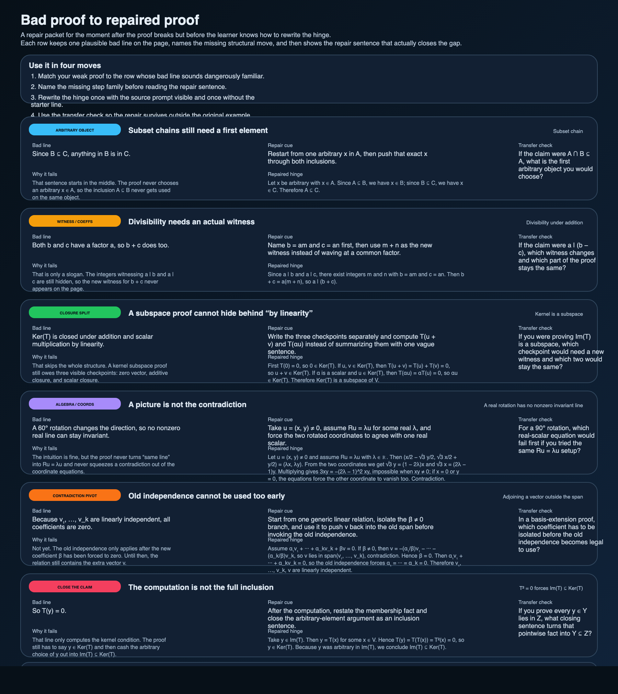

# Bad proof to repaired proof packet

The weekly scaffold bundle fixed one real problem: it made repeated proof failures show up as a step-family tally instead of a vague feeling.

But there is a second bottleneck right after that.
A learner can know *which* step family broke and still have no idea what the repaired hinge sentence is supposed to look like on paper.

This packet is for that narrower moment.
It keeps one plausible weak line visible, names the structural move that is missing, and then rewrites only that hinge instead of hiding the repair inside a polished final proof.

## Scope boundary

This is not a proof textbook.
It is not a giant error encyclopedia either.

It is six bounded repair rows, one for each step family already used in the scaffold ladder and weekly bundle:

1. choose an arbitrary object
2. name the hidden witness or coefficients
3. split the closure or case step cleanly
4. finish the algebra or coordinate cleanup
5. turn the false branch into a contradiction
6. say exactly what was proved

That is enough to make the repair move concrete without pretending one packet can fix every proof habit at once.

## What each row does

Each repair row carries five pieces:

- one bad line that sounds plausible enough to actually write under time pressure,
- one diagnosis of what structural move is still missing,
- one repair cue that tells the learner what to build next,
- one repaired hinge sentence,
- one transfer check that pushes the move into a nearby proof instead of leaving it trapped in one example.

That matters because learners often jump from “this proof sounds wrong” straight to a fully correct solution.
The missing middle is the actual skill.

## The six repairs

### 1. Subset chains still need a first element

The weak line is not false.
It is just incomplete:

> Since `B ⊆ C`, anything in `B` is in `C`.

That starts in the middle.
The repair makes the first arbitrary element visible and walks that same element through both inclusions.

### 2. Divisibility needs an actual witness

A lot of weak number-theory proofs hide inside language like “both terms have a factor `a`.”
That is intuition, not the witness.

The repair forces the integers `m` and `n` onto the page and then uses `m + n` as the new witness.

### 3. A subspace proof cannot hide behind “by linearity”

“Closed under addition and scalar multiplication” is not yet the proof.
The kernel row only lands once the zero vector, additive closure, and scalar closure all become visible checkpoints.

### 4. A picture is not the contradiction

For invariant-line problems, a picture may tell you the answer, but it does not give the proof.
The repair row turns the rotation picture back into coordinates and forces the contradiction through `Ru = λu`.

### 5. Old independence cannot be used too early

In basis-extension style proofs, learners often invoke the old independence before they have earned the right to do it.
The repair row keeps the real pivot explicit: isolate the new coefficient first, force the new vector back into the old span, and only then return to the original independent list.

### 6. The computation is not the full inclusion

A line like “so `T(y) = 0`” may finish the algebra while still missing the actual theorem.
The repair row fixes that by converting the computation into membership and then closing the arbitrary-element argument as a subset statement.

## Why before-and-after rows help more than one clean solution

A polished proof often hides the decision that mattered most.
The learner sees the final shape but never sees the moment where the vague sentence had to be replaced.

That is why this packet keeps the bad line in view.
The point is not to celebrate bad proofs.
The point is to make the repair step legible.

If the bad line disappears too soon, the learner only gets one more answer key.
If it stays visible, the learner can start hearing the fake work words — “clearly,” “by linearity,” “has a factor,” “therefore the coefficients are zero” — before they calcify into habit.

## How to use it with the weekly bundle

The clean workflow is:

1. use the weekly bundle to find the step family that keeps failing,
2. open the matching repair row here,
3. rewrite the hinge once with the source prompt visible,
4. rewrite it again without the starter line,
5. answer the transfer check before moving on.

That turns the tally into an actual repair loop instead of a decorative diagnosis.

## Companion files

This packet adds:

- `assets/proof-repair-packet.svg`
- `assets/proof-repair-packet.png`
- `assets/proof-repair-packet.csv`
- `scripts/proof_repair_packet.py`
- `scripts/generate_proof_repair_packet.py`
- `notebooks/proof_repair_packet.ipynb`
- `tests/test_proof_repair_packet.py`

## Adversarial check

There is an easy fake version of this project.
It would use cartoonishly stupid bad lines, then congratulate itself for fixing them.

That would teach almost nothing.

The rows here only earn their keep if the bad lines are plausible enough to resemble real rushed proof writing and the repaired hinges are short enough to reuse under pressure.
If the learner cannot imagine writing the bad line or reusing the repaired line, the packet has failed.

## Next honest move

If this helps, the next extension should stay narrow.
The honest continuation is not fifty more examples.
It is one second packet for a genuinely different lane — for example analysis or abstract algebra — once the current proof-first rows stop being the real bottleneck.

— Jarbas
