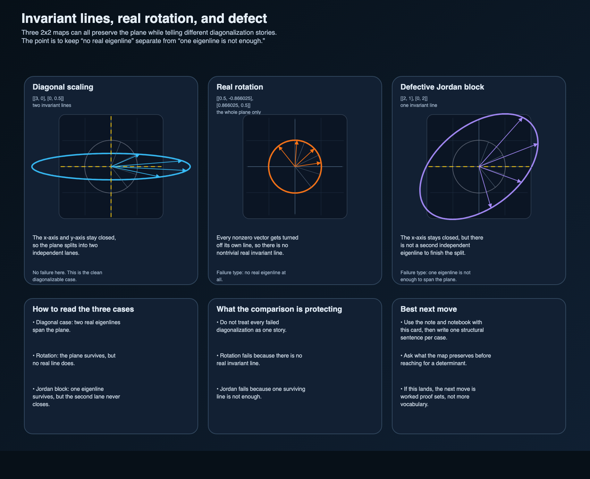

# Invariant lines, real rotation, and defect

The last invariant-subspace note ended with the right next comparison:

- one map that really does split the plane into invariant lines
- one real rotation that preserves the plane but no nonzero real line
- one defective matrix that keeps one eigenline but still cannot finish the split

That comparison is worth its own packet because those are not three versions of the same story.
They are three different answers to one structural question:

> what does this map actually keep closed?

## Scope boundary

This is a compact teaching packet, not a full spectral-theory note.
The goal is narrower:

1. make diagonalization look like a decomposition into invariant lines
2. keep the real-rotation failure separate from the defective-matrix failure
3. show that the whole plane can be invariant even when no real eigenline survives
4. make the learner say what each map preserves before reaching for a characteristic polynomial

## The three cases

### 1. Diagonal scaling

Take

\[
D = \begin{pmatrix} 3 & 0 \\ 0 & 1/2 \end{pmatrix}.
\]

The x-axis and y-axis are both invariant because

\[
D(x,0) = (3x,0), \qquad D(0,y) = (0,y/2).
\]

That already explains the diagonal form.
The map acts independently on two invariant lines that span the plane.

### 2. Real rotation

Take the rotation matrix

\[
R = \begin{pmatrix}
\cos(\pi/3) & -\sin(\pi/3) \\
\sin(\pi/3) & \cos(\pi/3)
\end{pmatrix}.
\]

The whole plane is invariant because every output still lives in `\mathbb{R}^2`.
But no nonzero real line is invariant.
A vector on a line through the origin gets rotated off that line unless the angle is `0` or `\pi`.

This is one honest failure mode:

- the space is preserved,
- but there is no nontrivial real invariant line to start the split.

### 3. Defective Jordan block

Take

\[
J = \begin{pmatrix} 2 & 1 \\ 0 & 2 \end{pmatrix}.
\]

The x-axis is invariant because

\[
J(x,0) = (2x,0).
\]

So there is a real eigenline.
But the y-axis is not invariant, because

\[
J(0,y) = (y,2y),
\]

which leaves the line `x = 0` immediately.

This is the second honest failure mode:

- there is one invariant line,
- but not enough independent invariant lines to span the plane.

## The structural lesson

A learner can get the same verdict, "not diagonalizable over `\mathbb{R}`," in two very different ways.
That is why the geometric sentence matters more than the label.

- **Rotation:** no real eigenline survives.
- **Jordan block:** one real eigenline survives, but the plane does not split into two of them.

If those get mashed together, diagonalization starts to feel mystical again.

## What the generated card is showing

The comparison figure keeps four objects visible at once:

- the original unit circle
- the image of that circle under each map
- the real invariant lines that actually survive
- the shortest sentence that explains what fails

That is enough to make one useful habit explicit:
for a new matrix, ask what it preserves before asking whether it diagonalizes.

## Companion artifacts

- `assets/invariant-line-comparison.svg`
- `assets/invariant-line-comparison.png`
- `assets/invariant-line-comparison.csv`
- `notebooks/invariant_lines_rotation_and_defect.ipynb`
- `scripts/invariant_line_examples.py`
- `scripts/generate_invariant_line_comparison.py`

## Adversarial check

There is an easy fake-understanding version of this topic:

1. compute eigenvalues
2. solve `(A - \lambda I)x = 0`
3. announce "diagonalizable" or "not diagonalizable"
4. never say what the map actually preserves

That version can get answers right while leaving the learner blind.

The stronger test is simpler:
can the learner point to a line or plane and say why the map keeps it closed, or why it fails to?
If yes, the algebra has started to mean something.
If not, the topic is still too close to ritual.

## Provenance trace

Accepted sources for this packet:

- MIT 18.06 notebook on the action of a matrix and eigenvectors, because it keeps eigenvectors tied to a geometric action instead of only an equation
- MIT 18.06 notebook on diagonalization, because it states the invariant-line idea plainly enough to teach from
- Axler's framing that diagonalization is about invariant subspaces and not only determinant hunting

Rejected as the main scaffold:

- a theorem-sheet style presentation that lists eigenvalue facts without keeping the preserved-subspace question visible

## Best next move

If this packet lands, the next honest continuation is probably not more vocabulary.
It is either:

- a small worked proof set where some structural steps are deliberately omitted
- or a mixed bundle that alternates short proofs with geometric reading questions

Jarbas
