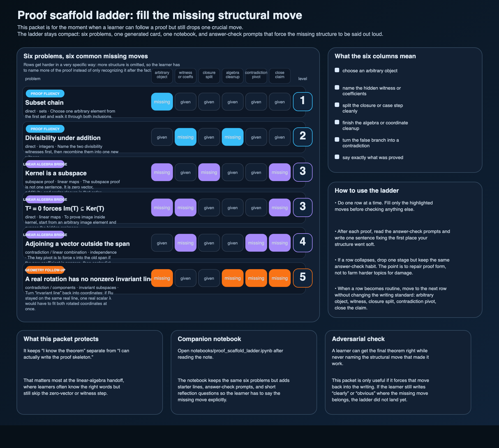

# Proof scaffold ladder: fill the missing structural move, not just the final sentence

The repo already had proof-method notes, review cards, and problem bundles.

What it still needed was one packet for a very specific failure mode:

- the learner recognizes the theorem,
- the learner even knows which method probably belongs,
- but one structural move still drops out of the written proof.

That is where this ladder lives.

## Scope boundary

This is not a full theorem sheet and not a giant workbook.
It is one compact ladder with six problems.
The point is narrower:

1. make the missing proof move visible,
2. force the learner to write that move explicitly,
3. raise the difficulty by omitting more structure, not by exploding the topic list.

## The six rows

The ladder moves through three stages.

### 1. Proof fluency

- **Subset chain**: choose one arbitrary element and walk it through both inclusions.
- **Divisibility under addition**: name the two hidden witnesses before recombining them into one new witness.

These two are small on purpose.
They are the right place to fix the habit of skipping the arbitrary-object or witness step and hoping the proof still looks convincing.

### 2. Linear algebra bridge

- **Kernel is a subspace**: say the zero-vector, additivity, and scalar-closure steps separately.
- **`T² = 0` forces `Im(T) ⊆ Ker(T)`**: expose the hidden preimage before using the hypothesis.
- **Adjoining a vector outside the span**: run the contradiction pivot cleanly instead of waving at “independence.”

This is the heart of the packet.
The bridge into linear algebra usually does not break because the learner has never heard the words.
It breaks because the learner stops naming the structural move once vectors and maps show up.

### 3. Geometry follow-up

- **A real rotation has no nonzero invariant line**: turn the picture back into coordinates and force the contradiction in writing.

That last row is there to protect the invariant-line packet from becoming slogan memory.
A picture helps, but the contradiction still has to be written down.

## What the six columns mean

Each highlighted column marks one move the learner has to supply.

- **choose an arbitrary object**
- **name the hidden witness or coefficients**
- **split the closure or case step cleanly**
- **finish the algebra or coordinate cleanup**
- **turn the false branch into a contradiction**
- **say exactly what was proved**

The point is not that every proof needs every column.
The point is that a learner can often finish the theorem statement while still missing one of those six moves.
This ladder makes that failure visible.

## How to use it

Do one row at a time.

For each row:

1. read the prompt,
2. use the starter line only to get moving,
3. fill the highlighted moves in full sentences,
4. run the answer-check prompts after writing,
5. rewrite the first vague sentence instead of only marking the proof “wrong.”

That rewrite step is the whole value here.
If the learner never goes back to replace “clearly” or “so” with the actual structural move, the packet has not done its job.

## Companion notebook

The notebook keeps the same six rows but adds starter lines, answer-check prompts, and short reflection questions.

Use it when the learner needs a little more steering than the static card provides:

- `notebooks/proof_scaffold_ladder.ipynb`

## Adversarial check

There is a fake-success version of proof practice where the learner can identify the right theorem and still skip the real hinge of the argument.

Examples:

- writing “take an element” without saying from which set,
- saying “there exist integers” without naming them,
- saying “closure follows by linearity” without computing anything,
- saying “contradiction” without showing which assumption got forced into the impossible branch,
- or ending with the last symbolic line but never stating what subset, independence, or invariant-line claim was actually proved.

This packet is only useful if those vague spots get replaced by the real move.

## Companion artifacts

- `assets/proof-scaffold-ladder.svg`
- `assets/proof-scaffold-ladder.png`
- `assets/proof-scaffold-ladder.csv`
- `scripts/proof_scaffold_ladder.py`
- `scripts/generate_proof_scaffold_ladder.py`
- `notebooks/proof_scaffold_ladder.ipynb`
- `tests/test_proof_scaffold_ladder.py`

## Best next move

If this lands, the next honest continuation is not a bigger note dump.
It is one weekly bundle built from the same idea:

- two rows from the proof-fluency lane,
- two rows from the linear-algebra bridge,
- one short reflection that asks which structural move kept failing.

That would turn the scaffold idea into a repeatable habit instead of one good card.

— Jarbas
