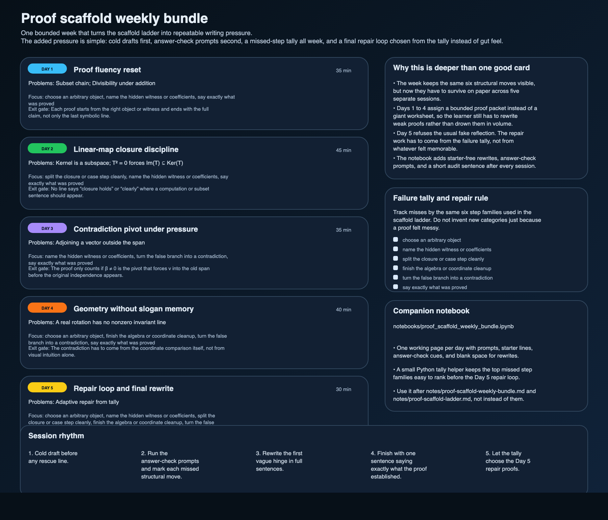

# Proof scaffold weekly bundle: one week of writing pressure, not one more nice-looking card

The proof scaffold ladder already did one useful job: it made the missing move visible.

What it did not do by itself was force that move to survive over several days.
A learner can fill one good row, nod along, and then go right back to dropping the same hinge the next morning.

This packet fixes that narrower problem.
It turns the ladder into one bounded week with four fixed sessions and one repair loop.
The point is not more topics.
The point is to make the same six structural moves hold up under repetition, light time pressure, and rewrite discipline.

## Scope boundary

This is not a new course.
It is not a giant workbook either.
It is one week long on purpose.

The week adds exactly four pieces of pressure:

1. **cold drafts first** so theorem recognition cannot do all the work,
2. **answer-check prompts after the draft** so the missed move has to be named,
3. **a running failure tally** so the learner stops guessing what keeps going wrong,
4. **a final repair loop** chosen from that tally instead of from mood or memory.

If those four things are missing, the week collapses back into pleasant review.

## The five sessions

### Day 1 — proof fluency reset

- **Problems:** subset chain; divisibility under addition
- **Focus:** arbitrary object, witness naming, closing the claim
- **Why it is first:** these are the cheapest places to catch the habit of skipping the starting object or the hidden witness and hoping the proof still sounds fine

### Day 2 — linear-map closure discipline

- **Problems:** kernel is a subspace; `T² = 0` forces `Im(T) ⊆ Ker(T)`
- **Focus:** closure split, hidden preimage, full subset conclusion
- **Why it matters:** this is where many learners start saying “closure holds” or “linearity handles it” instead of writing the actual map computation

### Day 3 — contradiction pivot under pressure

- **Problem:** adjoining a vector outside the old span
- **Focus:** coefficients, contradiction pivot, final independence claim
- **Why it matters:** the common slip is using the old independence too early, before the proof has actually forced the new vector back into the old span

### Day 4 — geometry without slogan memory

- **Problem:** a real rotation has no nonzero invariant line
- **Focus:** coordinates, algebra cleanup, contradiction, closing sentence
- **Why it matters:** a picture is helpful here, but the contradiction still has to come from equations instead of from pointing at a diagram

### Day 5 — repair loop and final rewrite

- **Problems:** chosen from the earlier packet by the failure tally
- **Focus:** whichever structural moves actually kept failing
- **Why it matters:** this is the part that stops the week from becoming fake reflection; the repair work has to come from evidence

## Why the week format adds real pressure

A weekly bundle is only worth shipping if it changes the actual practice behavior.
This one does that in three ways.

### 1. It separates first-draft fluency from rewrite discipline

A learner often gets one proof to look decent only after several untracked mental retries.
That hides the real failure.
The week fixes that by asking for:

- one cold attempt,
- one answer-check pass,
- one visible rewrite of the first vague hinge.

That is a better measure of proof fluency than a final cleaned-up page by itself.

### 2. It turns “I keep making sloppy mistakes” into a short measurable tally

The same six step families from the scaffold ladder stay active all week:

- choose an arbitrary object
- name the hidden witness or coefficients
- split the closure or case step cleanly
- finish the algebra or coordinate cleanup
- turn the false branch into a contradiction
- say exactly what was proved

That tally matters because proof failure is often misremembered.
A learner thinks the problem was “linear algebra” or “hard notation” when the real problem was still the same missing witness or missing closing sentence from two days ago.

### 3. It forces one bounded repair decision at the end

The week does not end with “reflect on what you learned.”
That prompt is too soft.

Instead, Day 5 asks for two starter-free rewrites chosen from the most frequent missed step families.
If the tally says the weak point was contradiction pivots, the repair proof has to involve a contradiction pivot.
If the tally says the weak point was closure structure, the repair proof has to come from the kernel row.

That is enough pressure to make the bundle useful without turning it into a month-long regime.

## Companion notebook

Use the notebook together with this note:

- `notebooks/proof_scaffold_weekly_bundle.ipynb`

The notebook gives each day a working page with:

- the assigned problems,
- starter lines that stay hidden until needed,
- answer-check prompts,
- space to mark the first vague sentence,
- room for the rewrite,
- and a small tally helper for ranking the missed step families before Day 5.

## Adversarial check

There is an easy way for a weekly bundle like this to fail.
It can become a decorated schedule that only repackages the same six rows.

That is not the point here.
The bundle only lands if the learner leaves the week with two things that were not already guaranteed by the card:

1. a short record of which structural move actually broke most often,
2. two starter-free repair proofs that attack that exact weakness.

If those are missing, the week was just organization theater.

## Related files

- `notes/proof-scaffold-ladder.md`
- `assets/proof-scaffold-weekly-bundle.svg`
- `assets/proof-scaffold-weekly-bundle.png`
- `assets/proof-scaffold-weekly-bundle.csv`
- `scripts/proof_scaffold_weekly_bundle.py`
- `scripts/generate_proof_scaffold_weekly_bundle.py`
- `notebooks/proof_scaffold_weekly_bundle.ipynb`
- `tests/test_proof_scaffold_weekly_bundle.py`

## Next honest move

If this packet proves useful, the next extension should stay narrow.
The clean continuation is not a bigger ladder.
It is one second weekly bundle with genuinely different proof moves or a better answer-check layer for analysis and abstract algebra once the current packet starts to feel routine.

— Jarbas
